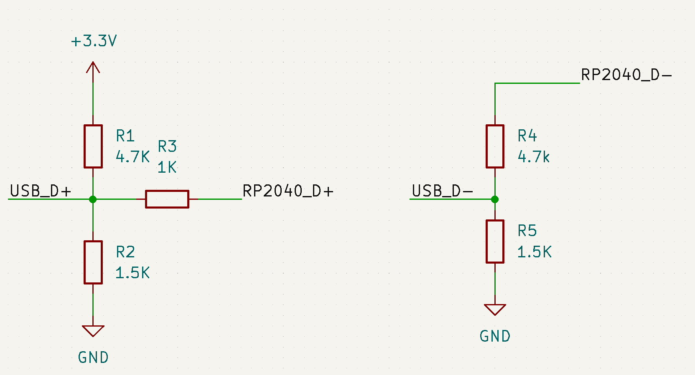

# rp2040_QC3
A QC3.0 driver for the Pi pico (RP2040)

Only supporting class A.

## Circuit

#### Connections

|  Pin   |  RP2040  |
| ----------- | -----------|
| RP2040_D+       | GP02   |
| RP2040_D-     | GP03   |

Based on: https://github.com/vdeconinck/QC3Control
